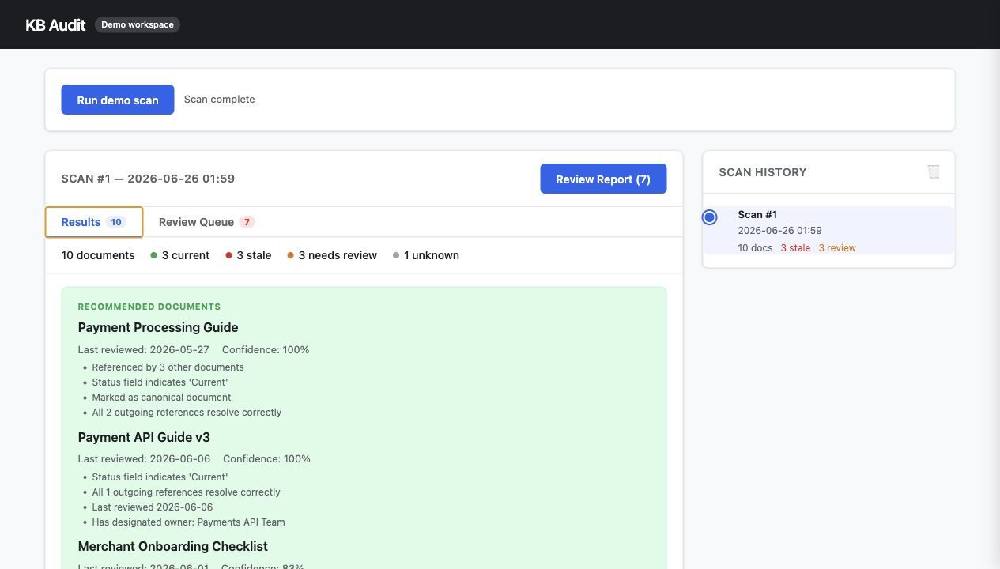
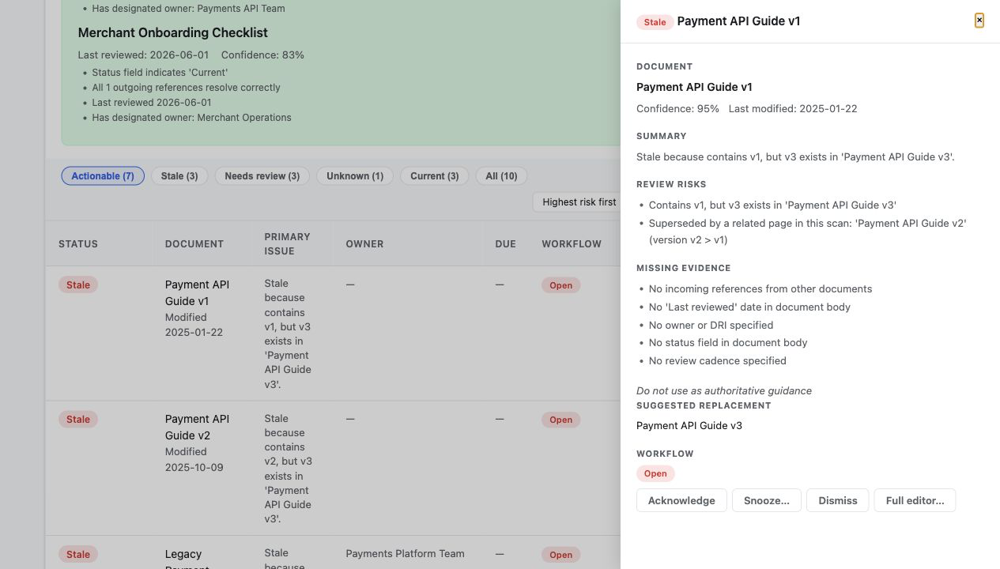
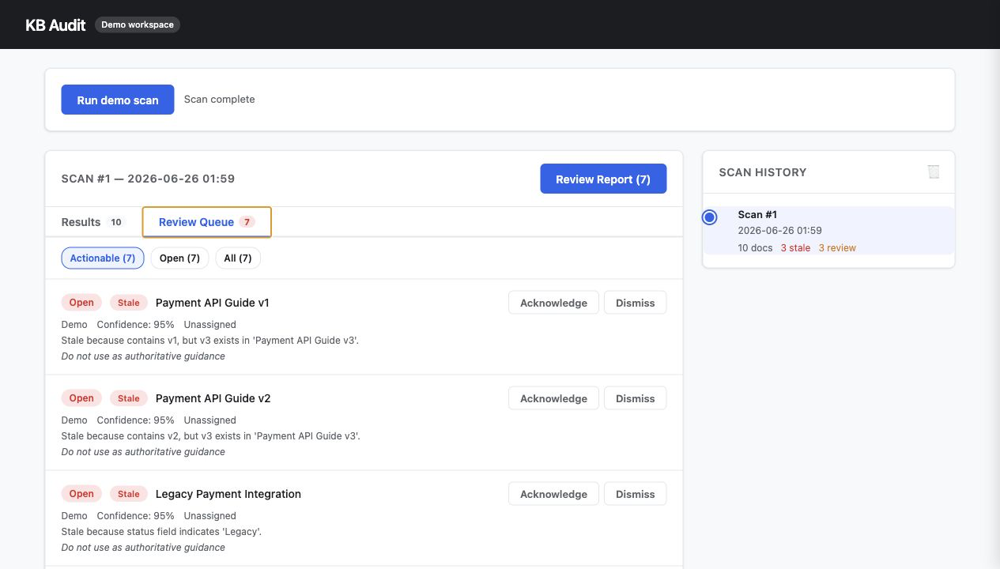

# Knowledge Base Auditor

Knowledge Base Auditor helps teams identify which internal knowledge base pages are trustworthy, which need review, and which appear stale or superseded.

It scans selected pages from Notion or Confluence Cloud and classifies documents using deterministic evidence: document metadata, review dates, ownership, links, references, duplicate/version relationships, and relationships among the pages included in each scan.

The goal is simple: before a person or AI assistant relies on a page, make the trust level visible.

## Why This Exists

Internal knowledge bases often contain several versions of the same guidance:

- an old API guide beside the current one
- migration notes that replaced legacy setup docs
- pages marked Current but not reviewed in years
- pages with broken links or unresolved references
- documents with no owner, status, or review history

Search can surface all of them. Knowledge Base Auditor helps answer:

- Which document should we trust?
- Which documents need human review?
- Which pages appear obsolete or superseded?
- Why was each page classified that way?

This is especially useful before connecting a knowledge base to AI search, Q&A, retrieval-augmented generation, or agent workflows.

## Current Status

This project is an early product prototype suitable for local evaluation, portfolio review, and design-partner conversations.

It is not yet a multi-tenant SaaS product. There is no hosted authentication, team administration, enterprise permissions layer, hosted scheduler, or managed deployment model yet.

The codebase was developed as an AI-assisted engineering project: product direction, architecture decisions, review, and acceptance criteria were human-led, while AI coding tools were used to accelerate implementation.

## What It Does

Knowledge Base Auditor scans selected pages and classifies each document as:

| Status | Meaning |
|---|---|
| `current` | Enough positive evidence exists, with no active review risks, to recommend the document as authoritative. |
| `needs_review` | The document may have positive trust evidence, but active review risks require human review. |
| `stale` | Strong evidence suggests the document is obsolete, superseded, deprecated, archived, or unsafe to rely on. |
| `unknown` | There is not enough evidence to classify the document confidently. |

The classifier is conservative:

- `current` requires positive trust evidence and no active review risks.
- Any active review risk, such as an old review date, overdue cadence, broken link, or unresolved reference, forces `needs_review`.
- Absence of stale signals is not enough to make a page current.
- `stale` requires strong obsolescence or supersession evidence.
- Classification and reference resolution operate only on the pages included in a scan.
- Page-tree and database scans analyze the selected hierarchy or database. Notion title and URL searches may also retrieve accessible pages with matching or related titles so version families can be compared.

Each result includes structured explanations with positive evidence, review risks, missing evidence, confidence, and a recommended action.

## Evidence Used

The trust model considers evidence such as:

- body metadata: `Status`, `Owner`, `DRI`, `Maintained by`, `Last reviewed`, `Canonical`, `Review cadence`, `Applies to`
- stale/supersession metadata: `Deprecated as of`, `Replaced by`, `Superseded by`
- Notion archived metadata
- Confluence Cloud modification dates and extracted links
- stored Confluence context such as version, author/editor, page status, ancestors, and space/page identifiers
- incoming and outgoing document references
- unresolved or ambiguous references among the pages in this scan
- broken external links
- duplicate and near-duplicate documents
- version chains such as `Guide v1`, `Guide v2`, `Guide v3`
- latest-version and replacement relationships among the pages in this scan

Confluence context is retained with the fetched document, but most of it is not currently classification evidence. In particular, Confluence API page status is not treated as proof that a document is trustworthy. Trust classification comes from the evidence model described above.

## Current Integrations

- Notion pages
- Notion page trees
- Notion databases
- Confluence Cloud spaces
- Confluence Cloud page trees
- Confluence CQL queries
- local SQLite scan history
- local SQLite review workflow queue
- CLI table reports
- JSON reports
- local FastAPI web UI
- credential-free CLI and web demo modes

## Review Workflow

Knowledge Base Auditor includes a lightweight review queue for acting on findings after a scan.

Workflow states:

- `open`
- `acknowledged`
- `dismissed`
- `fixed`
- `snoozed`
- `accepted_risk`

The default review queue shows actionable findings only. Terminal or intentionally deferred states, such as fixed, dismissed, accepted risk, and future-snoozed findings, can be included when needed.

Review metadata includes owner, due date, note, snooze date, and dismissal or acceptance reason. Findings are tracked with stable keys across scans, and issues can auto-resolve to `fixed` when the underlying evidence disappears on a later scan.

## Screenshots







## Quick Start

### Try The Demo

The built-in demo is the fastest way to evaluate the project. It requires no Notion or Confluence account, credentials, or network access to a knowledge base.

```bash
# From the project directory
python3 -m venv .venv
source .venv/bin/activate
pip install -e ".[dev,web]"

# Run the ten-page demo in the terminal
kb-audit demo

# Or start the demo web application
kb-audit-web --demo
```

Open `http://127.0.0.1:8080`, select **Run demo scan**, and explore the results and review queue.

The demo uses ten built-in pages and produces a stable result set:

| Status | Count |
|---|---:|
| Current | 3 |
| Stale | 3 |
| Needs review | 3 |
| Unknown | 1 |

It demonstrates version succession, suggested replacements, explicit legacy content, overdue review cadence, unresolved references, near-duplicate content, missing trust evidence, and the review workflow.

Demo scan history is stored separately in `kbaudit-demo.db`. Both demo entry points reset that database when they start, provided no demo scan is already active. Use `--database PATH` to choose a different demo database.

### Connect A Knowledge Base

Copy the environment template and edit `.env` for either Notion or Confluence Cloud:

```bash
cp .env.example .env
```

For Notion, create an integration at [https://www.notion.so/my-integrations](https://www.notion.so/my-integrations), set `NOTION_API_KEY`, and share the pages you want to audit with that integration.

For Confluence Cloud, create an Atlassian API token at [https://id.atlassian.com/manage-profile/security/api-tokens](https://id.atlassian.com/manage-profile/security/api-tokens), then set `CONFLUENCE_BASE_URL`, `CONFLUENCE_EMAIL`, and `CONFLUENCE_API_TOKEN`.

Python 3.11 or newer is required.

## CLI Usage

### Notion

```bash
# Scan all accessible Notion pages
kb-audit scan --source notion

# Scan a specific Notion page tree by page ID
kb-audit scan --source notion --root-page <page-id>

# Scan a Notion database
kb-audit scan --source notion --database-id <database-id>

# Scan by page title or Notion URL
kb-audit scan --source notion --query "Engineering"
```

Notion scan behavior depends on the selected mode:

- With no target, all pages shared with the integration are scanned.
- `--root-page` recursively scans that page and its child pages and databases.
- `--database-id` scans entries in the selected database.
- `--query` searches accessible pages by title, or resolves a Notion URL and searches for related title variants. This is useful for comparing pages such as `API Guide v1`, `API Guide v2`, and `API Guide v3`.

### Confluence Cloud

```bash
# Scan a Confluence space
kb-audit scan --source confluence --confluence-space ENG

# Scan a Confluence page tree by page ID
kb-audit scan --source confluence --confluence-page-id 123456789

# Scan with Confluence CQL
kb-audit scan --source confluence --query "space = ENG AND type = page"
```

Confluence scans remain within the selected space, page tree, or CQL result set.

If `--source` is omitted, the CLI selects Confluence when `CONFLUENCE_BASE_URL` and `CONFLUENCE_API_TOKEN` are present; otherwise it selects Notion. A Confluence scan also requires `CONFLUENCE_EMAIL`, so setting all three Confluence credential variables is recommended.

### Reports And History

```bash
# Show a console table
kb-audit scan --source notion --query "Engineering"

# Output JSON
kb-audit scan --source notion --query "Engineering" --format json --output report.json

# Run a scan without persisting to SQLite
kb-audit scan --source notion --query "Engineering" --no-db

# View scan history
kb-audit history

# View history from the demo database
kb-audit history --database kbaudit-demo.db
```

### Review Queue

```bash
# List actionable findings
kb-audit findings

# Include fixed, dismissed, accepted-risk, and snoozed findings
kb-audit findings --include-all

# Filter by workflow state or scan
kb-audit findings --state open,acknowledged
kb-audit findings --scan-id 12

# Update workflow state by finding-key prefix
kb-audit triage <finding-key-prefix> acknowledged --owner alice@example.com --due-date 2026-07-15
kb-audit triage <finding-key-prefix> snoozed --snooze-until 2026-08-01 --note "Waiting for platform migration"
kb-audit triage <finding-key-prefix> dismissed --reason "False positive"
kb-audit triage <finding-key-prefix> fixed --note "Updated stale references"
```

Add `--database kbaudit-demo.db` to `findings` or `triage` when working with CLI demo results.

## Web UI

Run the local web app:

```bash
kb-audit-web
```

Then open:

```text
http://127.0.0.1:8080
```

The web UI lets you run scans, review current/stale/needs-review/unknown results, inspect evidence, view scan history, download review reports, and work through the review queue.

The current web app chooses the configured source automatically. If a Confluence base URL and API token are present, it selects Confluence; otherwise it selects Notion. A working Confluence connection requires the base URL, email, and API token.

Useful options:

```bash
# Credential-free demo workspace
kb-audit-web --demo

# Choose a database, host, or port
kb-audit-web --database local-audit.db --host 127.0.0.1 --port 8081
```

In connected mode, the UI supports:

- Notion configured targets, page trees, databases, and title/URL searches
- Confluence configured targets, spaces, page trees, and CQL queries
- status and workflow filtering
- evidence and suggested-replacement details
- scan history and review-report downloads
- acknowledgment, assignment, due dates, snoozing, dismissal, accepted risk, and resolution

## Configuration

Create a `config.yaml` for custom settings. The repository also includes a Notion-oriented example at [examples/sample_config.yaml](examples/sample_config.yaml).

```yaml
notion:
  root_page_id: "your-notion-page-id"
  database_id: "your-notion-database-id"

confluence:
  base_url: "https://example.atlassian.net/wiki"
  email: "you@example.com"
  space_key: "ENG"
  page_id: "123456789"

database_url: "sqlite:///kbaudit.db"

analyzers:
  timestamp:
    warning_days: 90
    critical_days: 180
  similarity:
    threshold: 0.80
  version_refs:
    current_versions:
      api: "v3"
```

Keep secrets out of YAML committed to source control. Prefer `NOTION_API_KEY` and `CONFLUENCE_API_TOKEN` in `.env` or environment variables.

Run with:

```bash
kb-audit scan --config config.yaml
```

Environment variables:

```bash
NOTION_API_KEY=your-notion-integration-token

CONFLUENCE_BASE_URL=https://example.atlassian.net/wiki
CONFLUENCE_EMAIL=you@example.com
CONFLUENCE_API_TOKEN=your-atlassian-api-token
CONFLUENCE_SPACE_KEY=ENG
CONFLUENCE_PAGE_ID=123456789

DATABASE_URL=sqlite:///kbaudit.db
```

Environment variables override corresponding YAML settings where supported.

## Architecture

The tool follows a simple pipeline:

```text
Source -> Analyzers -> Trust Classifier -> Reporter / SQLite -> CLI / Web UI
```

Core pieces:

- `sources`: fetch documents from Notion, Confluence Cloud, or the built-in demo
- `analyzers`: detect evidence such as links, references, versions, duplicates, and timestamps
- `trust.py`: converts evidence into trust classification, confidence, and structured explanations
- `auditor.py`: orchestrates scans and analysis across pages in the scan
- `reporters`: render console and JSON output
- `db.py`: stores scan history, result metadata, and review workflow state in SQLite
- `web`: provides the local FastAPI UI and review workflow interface

## Analyzer Coverage

| Analyzer | What it detects |
|---|---|
| Timestamp | Documents older than configurable thresholds. |
| Similarity | Exact duplicates, near duplicates, and version chains. |
| Version Refs | References to configured outdated software versions. |
| Broken Links | External URLs that fail link checks. |
| References | Internal document references that resolve, fail to resolve, or are ambiguous within the pages in this scan. |

## Development

```bash
# Install development dependencies
pip install -e ".[dev,web]"

# Run unit and integration tests without browser tests
pytest -q -m "not browser" -p no:cacheprovider

# Install Chromium once, then run the complete suite
playwright install chromium
pytest -q -p no:cacheprovider

# Lint
ruff check src/ tests/ --no-cache

# Type check
mypy src/ --cache-dir /private/tmp/kbaudit-mypy-cache
```

The test suite includes unit, integration, workflow, API, CLI, golden-scenario, demo-pipeline, and Playwright browser coverage. The golden scenarios serve as an executable product specification for trust-classification behavior.

## Limitations

- The project is local-first and prototype-grade.
- There is no hosted user management, organization management, or enterprise deployment layer.
- Permission handling currently depends on what the configured Notion or Confluence integration can access.
- Heuristics are deterministic and explainable, but they are not a substitute for human review.
- External link checks can vary based on network access, authentication requirements, rate limits, and remote server behavior.
- Scans are started manually; scheduling and notifications are planned rather than implemented.
- The tool reports trust findings but does not yet intercept or rerank results inside external search, RAG, or agent systems.

## Commercialization Notes

The strongest product direction is a trust and governance layer for internal knowledge bases, especially before those knowledge bases are used by AI search, RAG, or agent systems.

Likely next product capabilities:

- scheduled scans
- Slack, Jira, Linear, or email notifications
- task creation and escalation for overdue reviews
- policy-based trust configuration by team, source, document type, or risk tolerance
- permission-aware scanning and reporting
- additional connectors such as Google Drive, SharePoint, GitHub, Slack, and Zendesk
- hosted authentication and organization management
- audit logs and compliance reporting
- deployment and security controls for enterprise use

## License

MIT
